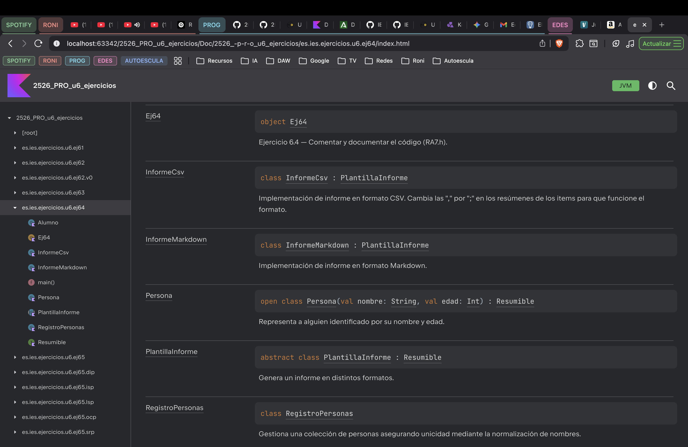

# Ejercicio 6.4 — Comentar y documentar el código (RA7.h)

Basado en la teoría de comentarios y documentación (KDoc/Dokka).

## Objetivo

Aprender a **documentar** correctamente un programa Kotlin usando **KDoc** y generar documentación HTML con **Dokka**, aplicando criterios para:

- añadir comentarios **necesarios** (aportan valor),
- evitar o eliminar comentarios **innecesarios** (redundantes/ruido),
- y dejar evidencias con enlaces permanentes a fragmentos de código.

## Entregables en este repositorio

- **Código** en `es.ies.ejercicios.u6.ej64` (se incluye una base “documentable”).
- **Documentación HTML generada por Dokka** en la carpeta `Doc/`.
- **Este Markdown** `docs/ejercicios/6.4.md` con:
  - memoria del proceso (instalación/ejecución),
  - captura o evidencia de la documentación generada,
  - respuestas teóricas,
  - permalinks a los cambios de código (añadir/quitar comentarios y KDoc).

## Práctica (código)

En el paquete `es.ies.ejercicios.u6.ej64` tienes un programa sencillo que mezcla conceptos de 6.1–6.3:

- herencia y subclases,
- clase abstracta e interfaces,
- constructores (`init`, primario/secundario) en jerarquías.

El programa genera informes (CSV/Markdown) de una lista de elementos “resumibles” (por ejemplo personas/alumnos) y además incluye una regla de negocio sencilla (normalización de nombre), ¿podría ser un buen candidato a comentario útil?.

Tarea:

a) Revisa el código y **añade KDoc** donde sea necesario (clases, funciones públicas, parámetros, retornos).  
b) Identifica **comentarios innecesarios** y elimínalos.  
c) Identifica partes donde un comentario **sí aporta valor** (por ejemplo, reglas de negocio o decisiones no evidentes) y añádelo o mejóralo.  
d) Actualiza/crea un `main` de demo (si lo necesitas) para poder ejecutar y ver “logs” por consola.

## Guía paso a paso (Dokka)

### 0) Configuración del proyecto (Gradle)

Este repositorio ya incluye la configuración mínima para generar HTML con Dokka:

- En `build.gradle.kts` se añade el plugin `org.jetbrains.dokka` para disponer de la tarea `dokkaHtml`.
- Se configura `tasks.dokkaHtml { outputDirectory = file("Doc") }` para que el HTML se genere en la carpeta `Doc/` (la carpeta que pide el enunciado).

Revisa estos cambios y entiéndelos antes de generar documentación.

1) Documenta el código con KDoc (antes de generar HTML).
2) Genera la documentación:
   - Si tienes wrapper: ejecuta `./gradlew dokkaHtml`.
   - Si no tienes wrapper o no funciona, ejecuta la tarea `dokkaHtml` desde IntelliJ (ventana Gradle).
3) Comprueba que se ha generado HTML en `Doc/`.
4) Añade una captura (imagen) o describe claramente qué se ha generado (pantalla principal, clases, etc.).

## Teoría (responder después de terminar la guía)

### a) ¿Por qué es importante comentar/documentar? ¿Cuál es la diferencia entre comentarios y documentación?

**¿Por qué es importante comentar/documentar?**

Es importante para dejar claro en todo momento lo que hace el código. Puede venir bien cuando, por ejemplo, haces una funcion y meses después no recuerdas porque la hiciste.

**¿Cuál es la diferencia entre comentarios y documentación?**

- El comentario es más propio del código, sirve para aclarar en el momento dudas que pueda tener el programador acerca de lo que hace algo en concreto. Suele explicar el "como" o el "porque".
- La documentación es más un manual. Suele explicar el cómo se usa algo en concreto.

### b) Describe **dos ejemplos** de comentarios importantes y necesarios (según la teoría) y enlaza a tu código.

Ejemplo 1:

https://github.com/IES-Rafael-Alberti/2526-u6-6-1-5-relacionejercicios-aaron050223/blob/7364140d276c88a5d24d1612c169ece5dfe89461/src/main/kotlin/es/ies/ejercicios/u6/ej64/ProgramaDocumentable.kt#L72-L80

Considero útil aclarar que el cambio de las "," a las ";" es importante, ya que si no se sustituyera el código no funcionaria de forma correcta.

Ejemplo 2:

https://github.com/IES-Rafael-Alberti/2526-u6-6-1-5-relacionejercicios-aaron050223/blob/7364140d276c88a5d24d1612c169ece5dfe89461/src/main/kotlin/es/ies/ejercicios/u6/ej64/ProgramaDocumentable.kt#L82-L103

Veo útil este comentario, ya que explica el caso en el que se utilizaría ese constructor.

### c) Describe **dos ejemplos** de comentarios/documentación no importante o innecesaria y enlaza a tu código (antes/después).

Ejemplo 1:

https://github.com/IES-Rafael-Alberti/2526-u6-6-1-5-relacionejercicios-aaron050223/blob/7364140d276c88a5d24d1612c169ece5dfe89461/src/main/kotlin/es/ies/ejercicios/u6/ej64/ProgramaDocumentable.kt#L112-L132

Veo un poco inútil este comentario porque los nombres de los atributos explican que información almacena esa variable.

Ejemplo 2:

https://github.com/IES-Rafael-Alberti/2526-u6-6-1-5-relacionejercicios-aaron050223/blob/7364140d276c88a5d24d1612c169ece5dfe89461/src/main/kotlin/es/ies/ejercicios/u6/ej64/ProgramaDocumentable.kt#L66-L70

A diferencia de `InformeCsv` donde se especifica un poco más, en esta explica algo que pone casi textualmente en el nombre de la clase, por lo que la veo un poco inútil.

### d) Porque la documentación se genera en el directorio `Doc/`? ¿Dónde se indica esto?

Aparece en esa carpeta porque en el `build.gradle.kts` se ha puesto explícitamente que aparezca ahi, mediante el siguiente trozo de código:

https://github.com/IES-Rafael-Alberti/2526-u6-6-1-5-relacionejercicios-aaron050223/blob/e9f3d344b37736051f3619d32db66aa6c3466c43/build.gradle.kts#L19-L21

## Enlaces permanentes a código (obligatorio)

Incluye enlaces permanentes a:

- KDoc que hayas añadido/mejorado.

  - Antes:
    https://github.com/IES-Rafael-Alberti/2526-u6-6-1-5-relacionejercicios-aaron050223/blob/6f0ce65c759da85cb45b9c1eba7d43ce2d3b5112/src/main/kotlin/es/ies/ejercicios/u6/ej64/ProgramaDocumentable.kt#L66-L79
  - Despues:
    https://github.com/IES-Rafael-Alberti/2526-u6-6-1-5-relacionejercicios-aaron050223/blob/1ae4baee81d5b3950fe649eb77c10125896bb8f2/src/main/kotlin/es/ies/ejercicios/u6/ej64/ProgramaDocumentable.kt#L82-L103

- Comentarios que hayas añadido porque aportan valor. 
  - He añadido este comentario porque pienso que da una información que es crucial para que el código funcione, y a lo mejor alguien que no sabe eso puede cambiarlo sin darse cuenta o sin saber lo importante que es.
  https://github.com/IES-Rafael-Alberti/2526-u6-6-1-5-relacionejercicios-aaron050223/blob/1ae4baee81d5b3950fe649eb77c10125896bb8f2/src/main/kotlin/es/ies/ejercicios/u6/ej64/ProgramaDocumentable.kt#L72-L80
- Comentarios innecesarios que hayas eliminado. 
  - He eliminado la parte de "Se normaliza el nombre para evitar registros duplicados por diferencias de espacios o mayúsculas/minúsculas." porque creo que no es necesario explicarlo, ya que si que es verdad que tiene un metodo que hace eso, pero la clase no sabe cual es el proposito, ya que de eso se encarga otra clase
  https://github.com/IES-Rafael-Alberti/2526-u6-6-1-5-relacionejercicios-aaron050223/blob/6f0ce65c759da85cb45b9c1eba7d43ce2d3b5112/src/main/kotlin/es/ies/ejercicios/u6/ej64/ProgramaDocumentable.kt#L97-L115

## Evidencias

- Captura o descripción de la documentación HTML generada en `Doc/`.

- (Opcional) salida por consola si tu demo ayuda a entender el programa.

## Recursos

- Teoría (comentarios y documentación): https://revilofe.github.io/section1/u06/teoria/PROG-U6.4.-comentariosYDocumentacion/
- Enlaces permanentes a código (GitHub Docs): https://docs.github.com/es/get-started/writing-on-github/working-with-advanced-formatting/creating-a-permanent-link-to-a-code-snippet

## Criterios (autoevaluación)

- He añadido KDoc donde corresponde y es útil.
- He eliminado comentarios innecesarios y he justificado por qué.
- He añadido comentarios solo cuando aportan valor (según la teoría).
- He generado Dokka HTML y lo he dejado en `Doc/`.
- He documentado el proceso y añadido permalinks a los cambios.
